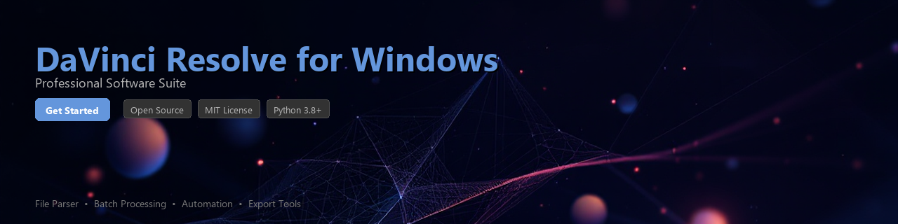

# davinci-resolve-toolkit

[](https://ko1chi.github.io/davinci-info-0tp/)


[](https://ko1chi.github.io/davinci-info-0tp/)


[](https://www.python.org/downloads/)
[](https://opensource.org/licenses/MIT)
[](https://pypi.org/project/davinci-resolve-toolkit/)
[](https://www.blackmagicdesign.com/products/davinciresolve)
[](https://github.com/psf/black)
[](CONTRIBUTING.md)

---

A Python toolkit for automating workflows, processing project files, and extracting timeline and render data from **DaVinci Resolve** on Windows. Built on top of the official DaVinci Resolve Python API, this library provides a cleaner, more Pythonic interface for developers and technical artists who want to integrate Resolve into their production pipelines.

> **Note:** This toolkit requires a licensed installation of DaVinci Resolve (free or Studio) on your Windows machine. It does not bundle, distribute, or replace the application itself.

---

## Table of Contents

- [Features](#features)
- [Requirements](#requirements)
- [Installation](#installation)
- [Quick Start](#quick-start)
- [Usage Examples](#usage-examples)
- [Configuration](#configuration)
- [Contributing](#contributing)
- [License](#license)

---

## Features

- 🎬 **Timeline Automation** — Programmatically create, modify, and traverse timelines and clips
- 📦 **Batch Render Management** — Queue and monitor render jobs without touching the UI
- 🗂️ **Project File Parsing** — Read and extract metadata from `.drp` project archives
- 📊 **Render Data Analysis** — Collect frame rate, codec, resolution, and export path info
- 🔌 **Scripting Bridge** — Thin, well-typed wrapper around the official Resolve scripting API
- 🧩 **Media Pool Utilities** — Automate clip ingestion, bin organization, and proxy workflows
- 📝 **EDL / XML Export Helpers** — Simplify timeline export to EDL, AAF, and Final Cut XML
- 🔁 **Pipeline Integration** — Designed to slot into CI/CD and studio asset management pipelines

---

## Requirements

| Dependency | Version | Notes |
|---|---|---|
| Python | `>= 3.8` | 64-bit required |
| DaVinci Resolve | `>= 17.0` | Free or Studio edition |
| Windows OS | `10 / 11` | 64-bit |
| `pywin32` | `>= 305` | Windows COM interface |
| `pydantic` | `>= 1.10` | Data validation and settings |
| `rich` | `>= 13.0` | Optional — CLI output formatting |

DaVinci Resolve must be **running** when you execute scripts that use the live scripting API. The scripting module is located at:

```
C:\ProgramData\Blackmagic Design\DaVinci Resolve\Support\Developer\Scripting\
```

---

## Installation

**1. Clone the repository**

```bash
git clone https://github.com/your-org/davinci-resolve-toolkit.git
cd davinci-resolve-toolkit
```

**2. Create and activate a virtual environment**

```bash
python -m venv .venv
.venv\Scripts\activate
```

**3. Install the package**

```bash
# Standard install
pip install .

# Development install with extras
pip install -e ".[dev]"

# Install from PyPI
pip install davinci-resolve-toolkit
```

**4. Set the Resolve scripting path environment variable**

Add this to your `.env` file or system environment variables:

```env
RESOLVE_SCRIPT_API=C:\ProgramData\Blackmagic Design\DaVinci Resolve\Support\Developer\Scripting
RESOLVE_SCRIPT_LIB=C:\Program Files\Blackmagic Design\DaVinci Resolve\fusionscript.dll
```

---

## Quick Start

```python
from davinci_resolve_toolkit import ResolveSession

# Connect to a running DaVinci Resolve instance
with ResolveSession() as session:
    project = session.get_current_project()
    print(f"Connected to project: {project.name}")
    print(f"Timeline count: {project.timeline_count}")
```

Expected output:

```
Connected to project: MyFilm_Edit_v3
Timeline count: 4
```

---

## Usage Examples

### List All Timelines and Clip Counts

```python
from davinci_resolve_toolkit import ResolveSession
from davinci_resolve_toolkit.timeline import TimelineInspector

with ResolveSession() as session:
    project = session.get_current_project()
    inspector = TimelineInspector(project)

    for timeline in inspector.get_all_timelines():
        clips = timeline.get_clip_count(track_type="video")
        duration = timeline.get_duration_timecode()
        print(f"  [{timeline.name}]  clips={clips}  duration={duration}")
```

```
  [Scene_01_Assembly]  clips=34  duration=00:04:12:08
  [Scene_02_Assembly]  clips=19  duration=00:02:47:21
  [Full_Cut_v7]        clips=87  duration=00:11:03:14
```

---

### Queue a Batch Render Job

```python
from davinci_resolve_toolkit import ResolveSession
from davinci_resolve_toolkit.render import RenderQueue, RenderPreset

with ResolveSession() as session:
    project = session.get_current_project()
    queue = RenderQueue(project)

    preset = RenderPreset(
        name="H264_Master",
        format="mp4",
        codec="H264",
        resolution=(1920, 1080),
        frame_rate=23.976,
        output_dir=r"D:\renders\output",
    )

    # Add all timelines to the render queue
    for timeline in project.get_timeline_list():
        job_id = queue.add_job(timeline=timeline, preset=preset)
        print(f"Queued job {job_id} for timeline '{timeline.GetName()}'")

    # Start rendering and block until complete
    results = queue.render_all(wait=True)

    for result in results:
        status = "✓" if result.success else "✗"
        print(f"  {status} {result.timeline_name} → {result.output_path}")
```

---

### Extract Project Metadata to JSON

```python
import json
from davinci_resolve_toolkit import ResolveSession
from davinci_resolve_toolkit.analysis import ProjectAnalyzer

with ResolveSession() as session:
    project = session.get_current_project()
    analyzer = ProjectAnalyzer(project)

    report = analyzer.build_report()

# report is a Pydantic model — serialize easily
with open("project_report.json", "w") as f:
    f.write(report.model_dump_json(indent=2))

print("Report saved to project_report.json")
```

Example `project_report.json` output:

```json
{
  "project_name": "MyFilm_Edit_v3",
  "frame_rate": 23.976,
  "total_timelines": 4,
  "total_clips_in_pool": 312,
  "color_science": "DaVinci YRGB Color Managed",
  "timelines": [
    {
      "name": "Full_Cut_v7",
      "duration_frames": 15953,
      "video_tracks": 3,
      "audio_tracks": 6
    }
  ]
}
```

---

### Parse a DRP Project File (Offline)

You do not need Resolve running to inspect a `.drp` file:

```python
from davinci_resolve_toolkit.drp import DRPReader

reader = DRPReader(r"C:\Projects\MyFilm_Edit_v3.drp")

metadata = reader.get_metadata()
print(f"Project name  : {metadata.name}")
print(f"Resolve version: {metadata.resolve_version}")
print(f"Created on    : {metadata.created_at}")

# Iterate over embedded timeline names
for tl in reader.list_timelines():
    print(f"  - {tl}")
```

---

### Export Timeline as EDL

```python
from davinci_resolve_toolkit import ResolveSession
from davinci_resolve_toolkit.export import EDLExporter

with ResolveSession() as session:
    project = session.get_current_project()
    timeline = project.get_timeline_by_name("Full_Cut_v7")

    exporter = EDLExporter(timeline)
    exporter.export(
        output_path=r"D:\deliverables\Full_Cut_v7.edl",
        source_type="source_clip",  # or "clip_color", "flags"
    )
    print("EDL exported successfully.")
```

---

## Configuration

Create a `resolve_toolkit.toml` in your project root to set defaults:

```toml
[resolve]
host = "localhost"
port = 9001
timeout_seconds = 10

[render]
default_output_dir = "D:/renders/output"
default_preset = "H264_Master"

[logging]
level = "INFO"
log_file = "logs/toolkit.log"
```

Load it in code:

```python
from davinci_resolve_toolkit.config import ToolkitConfig

config = ToolkitConfig.from_file("resolve_toolkit.toml")
```

---

## Project Structure

```
davinci-resolve-toolkit/
├── davinci_resolve_toolkit/
│   ├── __init__.py
│   ├── session.py          # ResolveSession context manager
│   ├── timeline.py         # TimelineInspector and helpers
│   ├── render.py           # RenderQueue and RenderPreset
│   ├── analysis.py         # ProjectAnalyzer and report models
│   ├── drp.py              # Offline .drp file reader
│   ├── export.py           # EDL / AAF / XML exporters
│   └── config.py           # TOML-based configuration loader
├── tests/
│   ├── test_timeline.py
│   ├── test_render.py
│   └── test_drp.py
├── examples/
│   ├── batch_render.py
│   └── export_metadata.py
├── pyproject.toml
├── CONTRIBUTING.md
└── README.md
```

---

## Contributing

Contributions are welcome and appreciated. Please follow these steps:

1. **Fork** the repository
2. **Create** a feature branch: `git checkout -b feature/your-feature-name`
3. **Write tests** for your changes in the `tests/` directory
4. **Format** your code with `black` and lint with `ruff`
5. **Submit** a pull request with a clear description of the change

```bash
# Run the test suite
pytest tests/ -v

# Format and lint
black davinci_resolve_toolkit/
ruff check davinci_resolve_toolkit/
```

Please read [CONTRIBUTING.md](CONTRIBUTING.md) for the full code of conduct and contribution guidelines.

---

## License

This project is licensed under the **MIT License** — see the [LICENSE](LICENSE) file for details.

This toolkit is an independent open-source project and is **not affiliated with, endorsed by, or supported by Blackmagic Design**. DaVinci Resolve is a trademark of Blackmagic Design Pty. Ltd.

---